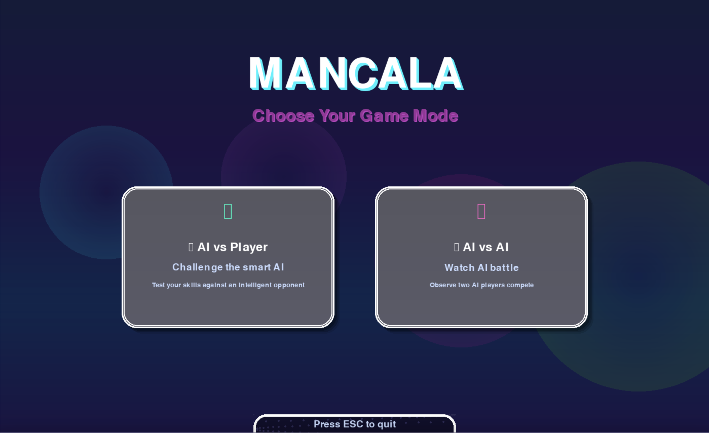
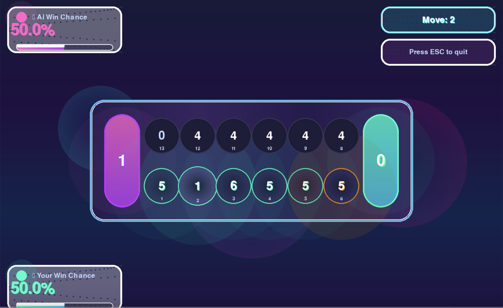
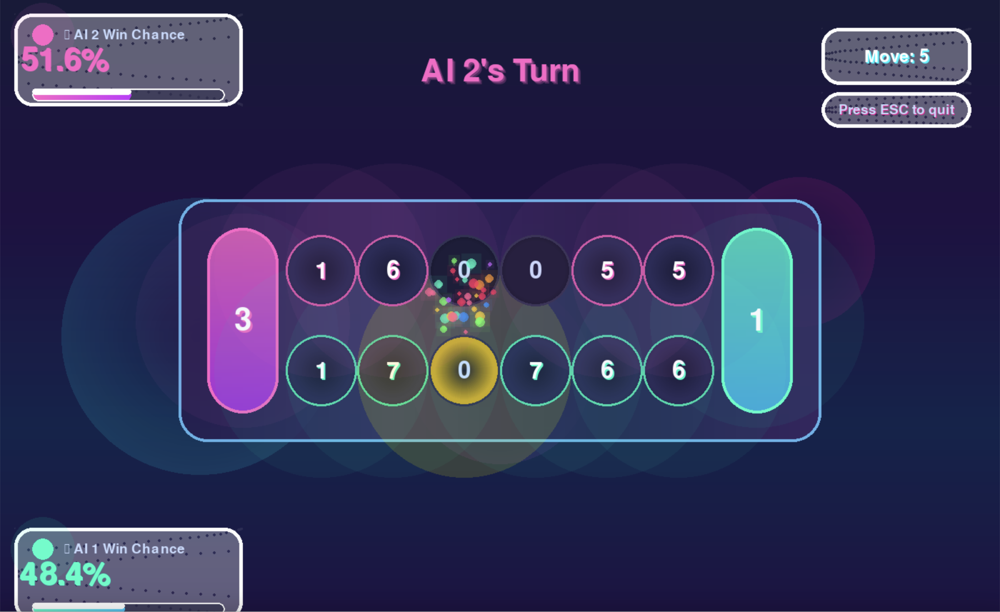
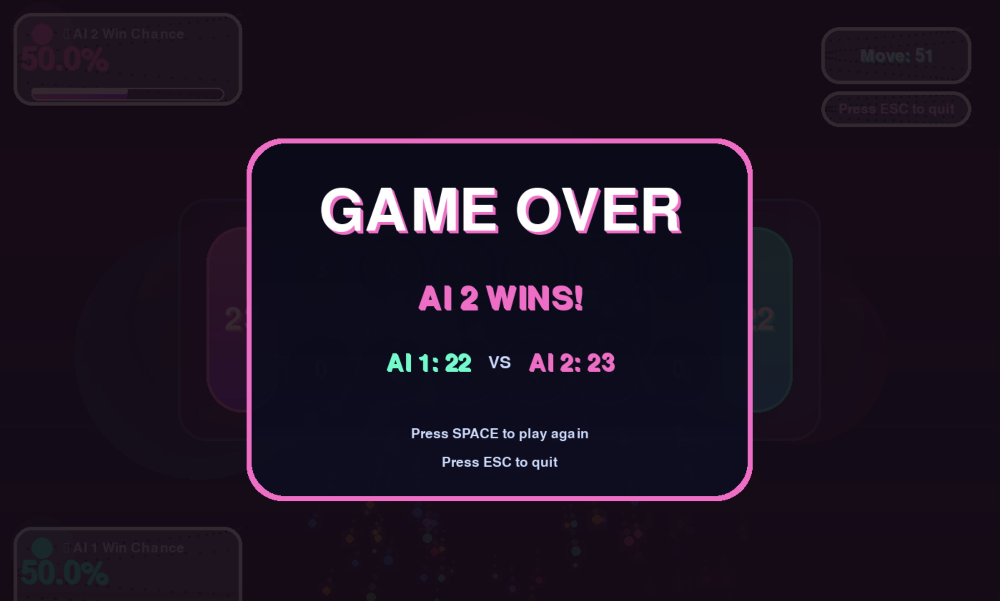

# 🎮 Ultra-Modern Mancala Game

A stunning, feature-rich implementation of the classic Mancala board game with advanced AI, beautiful neon UI, and smooth animations built with Python and Pygame.


## 📸 Screenshots

### Main Menu


### AI vs Player


### AI vs AI


### Game Over


---

### 🎯 Game Modes
- **AI vs Player** - Challenge an intelligent AI opponent with multiple difficulty levels
- **AI vs AI** - Watch two AI players compete with varying skill levels

### 🤖 Advanced AI
- **Alpha-Beta Pruning Algorithm** - Efficient minimax search up to depth 7
- **Fuzzy Logic** - Intelligent win probability calculations
- **Genetic Algorithm** - Strategic move suggestions for players
- **Randomized Difficulty** - AI depth ranges from 3-7 for varied gameplay
- **Adaptive Strategy** - 0-25% randomness factor for unpredictable moves

### 🎨 Visual Features
- **Glassmorphism UI** - Modern, translucent interface design
- **Neon Glow Effects** - Vibrant cyan, pink, and purple color scheme
- **Smooth Animations** - Particle effects, fountain animations, and screen shake
- **Animated Marble Distribution** - Watch each marble move one-by-one (0.15s per marble)
- **Dynamic Progress Bars** - Real-time win probability indicators
- **Hover Effects** - Interactive pit highlighting and scaling

### 📊 Game Statistics
- **Win Probability Tracking** - Live updates for both players
- **Move Counter** - Track total moves in each game
- **Score Display** - Real-time mancala (store) scores
- **AI Difficulty Indicator** - Shows current AI search depth

### 🎵 User Experience
- **Slow, Visible Gameplay** - 1 second selection + marble animation + 1-2 second turn transitions
- **Turn Indicators** - Clear messages for whose turn it is
- **Thinking Animation** - "AI Thinking..." message during AI computation
- **Restart Functionality** - Press SPACE to play again after game over
- **Easy Exit** - Press ESC anytime to quit

## 🚀 Getting Started

### Prerequisites

```bash
Python 3.8 or higher
```

### Required Libraries

```bash
pip install pygame numpy scikit-fuzzy
```

### Installation

1. Clone the repository:
```bash
git clone https://github.com/yourusername/mancala-game.git
cd mancala-game
```

2. Install dependencies:
```bash
pip install -r requirements.txt
```

3. Run the game:
```bash
python launcher_enhanced.py
```

## 📁 Project Structure

```
mancala-game/
│
├── launcher_enhanced.py          # Main launcher with game mode selection
├── ai_vs_player_enhanced.py      # Player vs AI game mode
├── ai_vs_ai_enhanced.py          # AI vs AI spectator mode
├── mancala_core.py               # Core game logic and AI algorithms
├── animations_enhanced.py        # Particle effects and animations
├── ui_config_enhanced.py         # UI constants, colors, and utilities
├── PressStart2P-Regular.ttf      # Retro game font
├── requirements.txt              # Python dependencies
└── README.md                     # This file
```

## 🎮 How to Play

### Basic Rules

1. **Objective**: Collect more stones in your mancala (store) than your opponent
2. **Setup**: 4 stones in each of the 6 pits per player, 0 in stores
3. **Turn**: Pick any pit on your side and distribute stones counter-clockwise
4. **Scoring**: Last stone lands in your store? Take another turn!
5. **Capture**: Last stone lands in your empty pit? Capture opposite pit's stones!
6. **End Game**: Game ends when one side has no stones left

### Controls

- **Mouse Click** - Select a pit to play (AI vs Player mode)
- **SPACE** - Restart game after game over
- **ESC** - Exit to main menu or quit game

### Game Flow (AI vs Player)

1. **Your Turn** (Player):
   - Hover over pits to see which ones you can play
   - Click a pit with stones
   - Watch selection highlight (1 second)
   - See marbles distribute one-by-one
   - View result display (1-2 seconds)

2. **AI Turn**:
   - "AI Thinking..." message (1 second)
   - AI selects pit (shown with highlight for 1 second)
   - Watch AI's marble distribution
   - View result display (1-2 seconds)

3. **Turn Transitions**:
   - 2 seconds between player ↔ AI switches
   - 1 second for extra turns

## 🧠 AI Implementation

### Algorithms Used

1. **Alpha-Beta Pruning**
   - Minimax algorithm with alpha-beta optimization
   - Variable depth search (3-7 levels)
   - Evaluates board position with weighted heuristics

2. **Fuzzy Logic System**
   - Input variables: stone difference, extra turns, capturing opportunities
   - Output: Win probability (0-100%)
   - 7 fuzzy rules for strategic evaluation

3. **Genetic Algorithm**
   - Provides move suggestions to human players
   - Evaluates multiple candidate moves
   - Optimizes for best tactical position

### Evaluation Function

```python
score = (store_difference × 100) + (side_stones_difference × 10)
```

## 🎨 Customization

### Colors

Edit `ui_config_enhanced.py` to customize the color scheme:

```python
PLAYER1_PRIMARY = (64, 224, 208)    # Cyan
PLAYER2_PRIMARY = (255, 105, 180)   # Pink
NEON_BLUE = (0, 255, 255)
NEON_PURPLE = (191, 64, 191)
NEON_PINK = (255, 20, 147)
```

### AI Difficulty

Modify AI depth in the game files:

```python
# ai_vs_player_enhanced.py (line ~780)
_, ai_move = alphabeta(mancala_board, 5, -100000, 100000, True)
#                                     ^ Change this (3-7 recommended)
```

### Animation Speed

Adjust marble distribution speed:

```python
# In animated_player_move method
time.sleep(0.15)  # Change this value (0.1-0.3 seconds)
```

## 🐛 Troubleshooting

### Game Won't Start

**Issue**: Black screen or immediate exit  
**Solution**: Ensure all dependencies are installed:
```bash
pip install --upgrade pygame numpy scikit-fuzzy
```

### Fuzzy Logic Errors

**Issue**: "Fuzzy logic not available" warning  
**Solution**: The game will automatically fallback to simple probability calculation. To fix:
```bash
pip install --upgrade scikit-fuzzy
```

### Performance Issues

**Issue**: Slow gameplay or lag  
**Solution**: 
- Reduce AI depth to 3-4
- Disable particle effects in `animations_enhanced.py`
- Update graphics drivers

## 🔮 Future Enhancements

- [ ] Online multiplayer mode
- [ ] Save/load game state
- [ ] Replay system with move history
- [ ] Tournament mode with brackets
- [ ] Mobile app (Android/iOS via Kivy)
- [ ] Sound effects and background music
- [ ] Multiple board variants (6, 7, 8 pits)
- [ ] AI training with machine learning
- [ ] Leaderboard and statistics tracking

## 🤝 Contributing

Contributions are welcome! Please feel free to submit a Pull Request.

1. Fork the repository
2. Create your feature branch (`git checkout -b feature/AmazingFeature`)
3. Commit your changes (`git commit -m 'Add some AmazingFeature'`)
4. Push to the branch (`git push origin feature/AmazingFeature`)
5. Open a Pull Request

## 📝 License

This project is licensed under the MIT License - see the [LICENSE](LICENSE) file for details.

## 👏 Acknowledgments

- **Mancala Rules**: Traditional African board game
- **Alpha-Beta Algorithm**: Classic game theory implementation
- **Fuzzy Logic**: scikit-fuzzy library
- **UI Design**: Glassmorphism and neon aesthetics
- **Font**: Press Start 2P by CodeMan38

## 📧 Contact

Your Name - [s m shible sadik] - smsadik82@gmail.com


